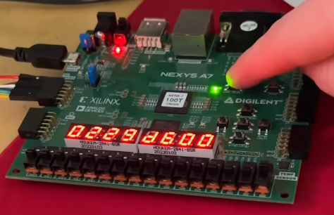

# Topaz-Geyser-RV32E
6-Stage Pipelined RV32E core written in SystemVerilog.

Instruction Fetch &rarr; Instruction Decode &rarr; Execute &rarr; Memory Prep &rarr; Memory Execute &rarr; Writeback

The Memory stage was split into two separate stages to resolve data hazards.

---

Here is an image of the core running a program on a physical FPGA. This program approximates 11! * sin(2) using a taylor series and then displays it on the seven-segment display. The correct output should be (`0x0229D600`)

---

The SRAM this core was designed to operate with is the Infineon CY62128EV30 1-Mbit (128K x 8) SRAM IC.

The SPI controller has been tested with the Winbond W25Q64JV 64-Mbit SPI Flash IC.

---

Memory Map:
| Addresses | Device(s) Name | Description |
| --------- | --------- | ----------- |
| `0x0` - `0xFFF` | CSR's | I did not implement any of the RISC-V standard CSR's. A few of RV32E's unused addresses are used for custom functions described below. Load/store instructions involving unimplemented RISC-V CSR addresses have undefined behavior. |
| `0x800` | SPI_TRANSFER Register | Writing a byte to this pseudo-register will command the SPI controller to send said byte to the connected SPI device as well as generate SPI clocks as defined by the protocol.  While the SPI command byte is being transmitted over the MOSI line (triggered by a `sb` to this address), the MISO line will be stored in a physical register located at this address.  So, for example, if a particular device expects to receive 4 bytes as an address and then will respond with the byte stored at that address in the next 8 clock cycles: you would `sb a0 0x800(x0)` `srl a0 a0 8` four times, and then send a dummy byte (`sb x0 0x800(x0)`) to send the 8 clocks to receive the byte which you could then access with `lb t0 0x800(x0)`. NOTE: You must insert one clock cycle between subsequent load or store instructions to the SPI_TRANSFER register. |
| `0x801` | SPI_CSR Register | [NC(7), NC(6), NC(5), NC(4), CS(3), NC(2), NC(1), BSY(0)] This register controls the chip-select signal for the SPI device as well as the SPI controller's busyness. There were plans to use bits 1 and 2 for controlling the PHA and POL for the SPI mode.   Attempts to write to the BSY bit will have no effect, so it can be ignored when updating CS.  The BSY bit needs to be checked before reading the SPI_TRANSFER register. |
| `0x803` | Switch Input Register | This 2-byte register is connected to the FPGA switch inputs. Address `0x803` must be read from using `lh t0 0x803(x0)`. Reading from `0x802` using `lb t0 0x802(x0)` will not read the left byte as you may expect. |
| `0x804` | Seven-segment Display | This 4-byte register controls the seven-segment display. Similarly to the Switch Input Register, you cannot for example write a byte to `0x807` to only modify the last byte of the display. You may only write directly to `0x804`.  The only supported memory operations are: `sw`, `lw`, `lh`, `lhu`, `lb`, and `lbu`.
| `0x1000` - `0x4FFF` | Data TCM | Supports reads and writes. Is byte-addressable. Supports misaligned-addresses with no performance overhead. The hazard unit will stall for load-use hazards involving this address space. |
| `0x5000` - `0x8FFF` | Instruction TCM | Supports reads and writes. Is not byte-addressable. Does not support misaligned-addresses. `lw`, `lh`, `lhu`, `lb`, and `lbu` are supported for word-aligned addresses only. `sh` and `sb` are unsupported for this address space. The hazard unit will stall for load-use hazards involving this address space. |
| `0x9000` - `0x28FFF` | SRAM | This space is byte addressible and only supports `lb`, `lbu`, and `sb` instructions. The hazard unit will stall for load-use hazards involving this address space. |
| `0x29000` - `0xFFFFFFFF` | Unoccupied | This address space has no function and load/store instructions involving this address space have undefined behavior. |
